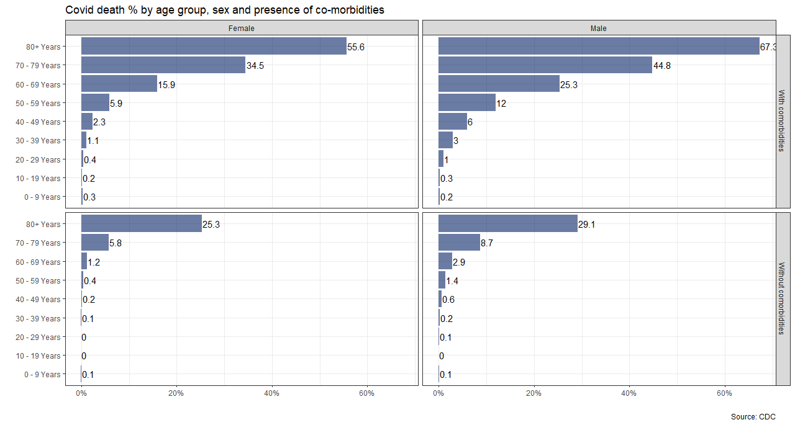
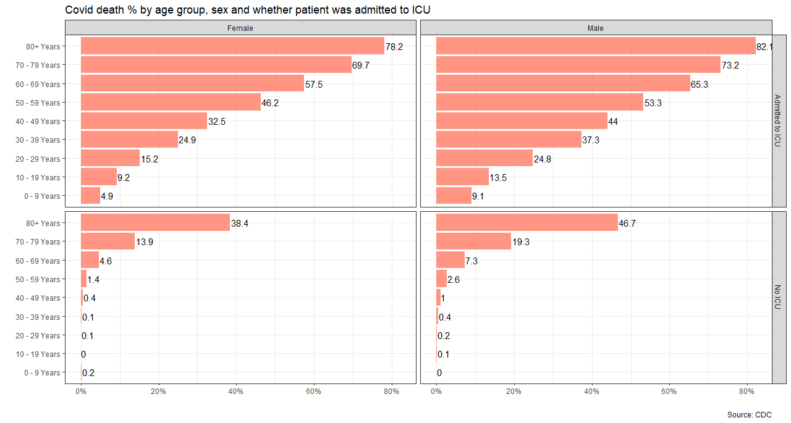

---
categories:
- ""
- ""
date: "2017-10-31T22:42:51-05:00"
description: This data has been provided by the CDC Case Surveillance Task Force and last updated on 30 September 2020
draft: false
image: pic07.jpg
keywords: ""
slug: covid
title: CDC Covid-19 Case Surveillance
---

```{r, setup, include=FALSE}
knitr::opts_chunk$set(
  message = FALSE, 
  warning = FALSE, 
  tidy=FALSE,     # display code as typed
  size="small")   # slightly smaller font for code
options(digits = 3)

# default figure size
knitr::opts_chunk$set(
  fig.width=6.75, 
  fig.height=6.75,
  fig.align = "center"
)
```


```{r load-libraries, include=FALSE}
library(tidyverse)  # Load ggplot2, dplyr, and all the other tidyverse packages
library(mosaic)
library(ggthemes)
library(lubridate)
library(here)
library(skimr)
library(janitor)
library(httr)
library(readxl)
library(vroom)
library(infer)
```

This data has been provided by the CDC Case Surveillance Task Force and last updated on 30 September 2020. In this dataset there are well over 3 million entries of individual, de-identified patient data. As this is a large file, I used `vroom` to load it and kekt `cache=TRUE` in the chunk options.

```{r, cache=TRUE}
# file contains 11 variables and 3.66m rows and is well over 380Mb. 
# It will take time to download

# URL link to CDC to download data
url <- "https://data.cdc.gov/api/views/vbim-akqf/rows.csv?accessType=DOWNLOAD"

covid_data <- vroom::vroom(url)%>% # If vroom::vroom(url) doesn't work, use read_csv(url)
  clean_names()


```

Given the data, I have produce two graphs that show death % rate:

1. by age group, sex, and whether the patient had co-morbidities or not
2. by age group, sex, and whether the patient was admited to Intensive Care Unit (ICU) or not.


```{r covid_challenge, echo=FALSE, out.width="100%"}
#image:  
#image:  

knitr::include_graphics(here::here("content","blogs","covid_death_rate_comorbidities.png"), error = FALSE)
knitr::include_graphics(here::here("content","blogs","covid_death_rate_icu.png"), error = FALSE)

#, error = FALSE)
#, error = FALSE)